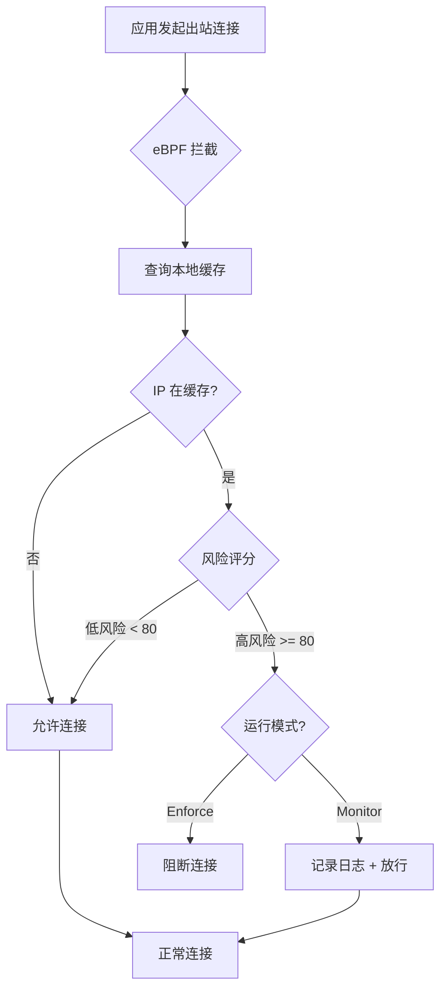
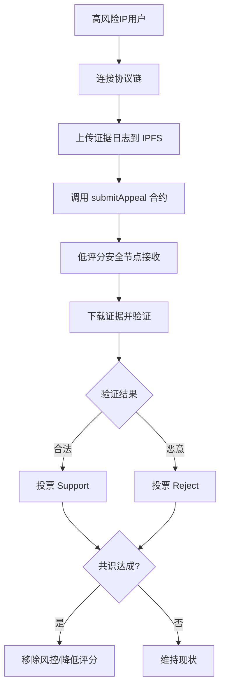

# OraSRS 出站保护与治理机制设计文档

## 概述

本文档描述 OraSRS 协议的出站流量审查 (Egress Protection) 和去中心化治理 (Decentralized Governance) 机制设计，旨在防止 0-day 攻击的外联行为，同时确保测试阶段的安全性和可控性。

## 1. 出站保护机制 (Egress Protection)

### 1.1 设计目标
- **防御 0-day 外联**: 阻止被入侵节点连接到 C&C 服务器或恶意下载源
- **低延迟**: 通过本地缓存实现毫秒级查询
- **可控性**: 测试阶段默认"监控模式"，避免误杀业务流量

### 1.2 工作流程



### 1.3 eBPF 实现

#### 监控模式 (Monitor Mode - 默认)
```c
// 伪代码
int egress_filter(struct xdp_md *ctx) {
    struct iphdr *ip = parse_ip(ctx);
    u32 dest_ip = ip->daddr;
    
    // 查询本地 BPF Map
    struct risk_info *risk = bpf_map_lookup_elem(&risk_cache, &dest_ip);
    
    if (risk && risk->score >= 80) {
        // 监控模式：记录但不阻断
        bpf_trace_printk("[OraSRS] 警告: 连接到高风险IP %pI4 (评分: %d), 监控模式已放行\n", 
                         &dest_ip, risk->score);
        return XDP_PASS;  // 放行
    }
    
    return XDP_PASS;
}
```

#### 强制模式 (Enforce Mode)
```c
int egress_filter(struct xdp_md *ctx) {
    // ... 同上 ...
    
    if (risk && risk->score >= 80) {
        if (enforce_mode) {
            bpf_trace_printk("[OraSRS] 阻断: 连接到高风险IP %pI4 (评分: %d)\n", 
                             &dest_ip, risk->score);
            return XDP_DROP;  // 阻断
        }
    }
    
    return XDP_PASS;
}
```

### 1.4 配置文件 (orasrs.yaml)

```yaml
egress_protection:
  enabled: true
  mode: "monitor"  # 选项: monitor | enforce | disabled
  
  # 测试期限制
  max_block_duration: 3600  # 最长封禁 1 小时
  
  # 缓存更新
  cache_update_interval: 300  # 每 5 分钟增量更新高风险 IP
  
  # 风险阈值
  risk_threshold: 80  # 评分 >= 80 触发审查
  
  # 审计日志
  audit_log: "/var/log/orasrs/egress_audit.log"
```

### 1.5 本地缓存增量更新

客户端在后台定期从协议链下载高风险 IP 列表：

```javascript
async function updateEgressCache() {
  const highRiskIPs = await blockchainConnector.getHighRiskIPs({
    minScore: 80,
    limit: 10000
  });
  
  // 更新 eBPF Map
  for (const ip of highRiskIPs) {
    ebpfMap.set(ip.address, {
      score: ip.score,
      isBlocked: ip.isBlocked,
      expiry: Date.now() + 3600000  // 1 小时后过期
    });
  }
}

// 每 5 分钟更新一次
setInterval(updateEgressCache, 300000);
```

### 1.6 审计日志格式

```
[2025-12-15T00:30:00Z] [PID:1234] [curl] [1.2.3.4] [Score:95] [Action:ALLOWED(Monitor)] [Reason:TestMode]
[2025-12-15T00:31:00Z] [PID:5678] [wget] [5.6.7.8] [Score:85] [Action:BLOCKED(Enforce)] [Reason:HighRisk]
```

## 2. 人工申诉机制 (Appeal Mechanism)

### 2.1 申诉流程



### 2.2 智能合约接口

```solidity
// 申诉合约
contract AppealContract {
    struct Appeal {
        address appellant;
        string targetIP;
        string evidenceHash;  // IPFS 哈希
        uint256 timestamp;
        uint256 supportVotes;
        uint256 rejectVotes;
        bool resolved;
    }
    
    mapping(uint256 => Appeal) public appeals;
    
    // 提交申诉
    function submitAppeal(string memory targetIP, string memory evidenceHash) 
        external returns (uint256 appealID);
    
    // 投票
    function castVote(uint256 appealID, bool support) external;
    
    // 解决申诉
    function resolveAppeal(uint256 appealID) external;
}
```

### 2.3 低评分安全节点资格

只有满足以下条件的节点才能参与治理投票：

| 条件 | 要求 | 验证方式 |
|------|------|---------|
| 风险评分 | < 10 (0-100 scale) | 链上查询 |
| 在线时长 | >= 72 小时 | 节点心跳记录 |
| 客户端版本 | >= v2.1 | 版本号验证 |
| 声誉值 | >= 60 | 基于历史行为 |

### 2.4 投票激励

```javascript
// 投票奖励计算
function calculateVotingReward(nodeAddress, appealID) {
  const appeal = getAppeal(appealID);
  const nodeVote = getVote(nodeAddress, appealID);
  const finalResult = appeal.resolved ? appeal.supportVotes > appeal.rejectVotes : null;
  
  if (nodeVote === finalResult) {
    // 投票正确，奖励声誉值
    increaseReputation(nodeAddress, 1);
    // 降低风险评分（更安全）
    decreaseRiskScore(nodeAddress, 0.1);
  }
}
```

## 3. 评分自动下调机制

### 3.1 时间衰减规则

```javascript
function calculateScoreDecay(ip) {
  const lastIncident = getLastIncidentTime(ip);
  const daysSinceIncident = (Date.now() - lastIncident) / 86400000;
  
  if (daysSinceIncident >= 30) {
    // 30 天无异常，评分降低 20%
    return currentScore * 0.8;
  } else if (daysSinceIncident >= 7) {
    // 7 天无异常，评分降低 10%
    return currentScore * 0.9;
  }
  
  return currentScore;
}
```

### 3.2 自动下调时间表

| 无异常时长 | 评分调整 | 示例 |
|-----------|---------|------|
| 7 天 | -10% | 90 → 81 |
| 30 天 | -20% | 90 → 72 |
| 90 天 | -50% | 90 → 45 |
| 180 天 | 重置为 0 | 90 → 0 |

## 4. 风控 IP 审核机制

### 4.1 多层审核流程

```
高评分 IP (Score >= 80)
    ↓
AI 辅助审核 (检测模式、频率、目标)
    ↓
治理合约投票 (低评分节点共识)
    ↓
管理员人工审核 (可选)
    ↓
加入风控列表 (isBlocked = true)
```

### 4.2 AI 辅助审核指标

```python
def ai_risk_assessment(ip_behavior):
    score = 0
    
    # 扫描行为
    if ip_behavior.scan_ports > 100:
        score += 30
    
    # 暴力破解
    if ip_behavior.failed_logins > 10:
        score += 25
    
    # 异常流量
    if ip_behavior.traffic_spike > 1000:
        score += 20
    
    # 恶意 Payload
    if ip_behavior.malicious_patterns > 0:
        score += 25
    
    return score
```

## 5. 开发者治理权限 (Developer Governance)

### 5.1 时间锁机制 (Timelock)

```solidity
contract OraSRSGovernance {
    uint256 public constant TIMELOCK_DELAY = 24 hours;
    
    struct ProposedAction {
        bytes32 actionHash;
        uint256 executeTime;
        bool executed;
    }
    
    mapping(bytes32 => ProposedAction) public proposals;
    
    // 提议操作（24小时后生效）
    function proposeAction(bytes memory action) external onlyDeveloper {
        bytes32 hash = keccak256(action);
        proposals[hash] = ProposedAction({
            actionHash: hash,
            executeTime: block.timestamp + TIMELOCK_DELAY,
            executed: false
        });
    }
    
    // 执行操作
    function executeAction(bytes memory action) external onlyDeveloper {
        bytes32 hash = keccak256(action);
        require(block.timestamp >= proposals[hash].executeTime, "Timelock not expired");
        // 执行操作...
    }
}
```

### 5.2 权限分类

#### 日常维护权限 (24h Timelock)
- 修改评分算法参数
- 升级合约逻辑
- 移除误报的风控 IP
- 版本迭代

#### 紧急权限 (0s - 立即生效)
- `PAUSE()`: 暂停整个协议
- `freezeFunction()`: 冻结特定功能
- `emergencyWithdraw()`: 紧急资金提取

**触发条件**:
- 发现严重漏洞
- 遭受黑客攻击
- 系统异常行为

### 5.3 开发者权限使用日志

所有开发者操作必须记录在链上：

```solidity
event DeveloperAction(
    address indexed developer,
    string actionType,
    bytes32 actionHash,
    uint256 timestamp,
    bool isEmergency
);
```

## 6. 测试阶段配置

### 6.1 安全限制

```yaml
# 测试阶段配置
beta_mode:
  enabled: true
  
  # eBPF 默认监控模式
  egress_enforce: false
  
  # 限制封禁时长
  max_block_duration: 3600  # 1 小时
  
  # 操作留痕
  audit_enabled: true
  audit_retention_days: 90
  
  # 熔断开关
  circuit_breaker:
    enabled: true
    error_threshold: 10  # 10 次误报触发熔断
    cooldown_period: 300  # 5 分钟冷却
```

### 6.2 本地熔断开关

```javascript
class CircuitBreaker {
  constructor() {
    this.errorCount = 0;
    this.threshold = 10;
    this.state = 'CLOSED';  // CLOSED | OPEN | HALF_OPEN
  }
  
  recordError() {
    this.errorCount++;
    if (this.errorCount >= this.threshold) {
      this.state = 'OPEN';
      console.warn('[OraSRS] 熔断器触发：检测到过多误报，暂停出站审查');
      setTimeout(() => this.state = 'HALF_OPEN', 300000);
    }
  }
  
  shouldBlock(ip) {
    if (this.state === 'OPEN') {
      return false;  // 熔断状态，不阻断
    }
    // 正常逻辑...
  }
}
```

## 7. 免责声明

### 7.1 README 声明

```markdown
## ⚠️ 测试阶段免责声明 (Beta Testing Disclaimer)

**OraSRS 协议及其客户端目前处于 Beta 测试阶段。**

### 功能限制
- **出站审查模块** (Egress Inspection) 默认运行在"监控模式 (Monitor Mode)"
- 不会实际阻断网络连接，除非用户手动在配置中开启"强制模式 (Enforce Mode)"

### 风险提示
- 开启内核级熔断 (eBPF) 可能会在特定的内核版本或网络环境下导致：
  - 系统不稳定
  - 网络延迟增加
  - 业务中断

### 责任豁免
开发者不对因使用本软件（包括但不限于误拦截、系统崩溃、数据丢失）造成的任何直接或间接损失承担责任。

**用户应在非生产环境中充分测试后再行部署。**

### 治理权
在测试期间，为了维护网络安全，开发者保留：
- 紧急暂停协议的权利（立即生效）
- 重置数据的权利（24 小时时间锁）
```

### 7.2 启动 Banner

```
╔═══════════════════════════════════════════════════════════╗
║  OraSRS v2.1 - Beta Testing Version                      ║
║  ⚠️  WARNING: Egress Protection in MONITOR MODE          ║
║                                                           ║
║  This software is in BETA. Use at your own risk.         ║
║  See README.md for full disclaimer.                      ║
╚═══════════════════════════════════════════════════════════╝
```

## 8. 实施路线图

### Phase 1: 基础设施 (当前)
- [x] 入站保护 (HVAP, IoT Shield)
- [ ] 出站审查模块设计
- [ ] eBPF 监控模式实现

### Phase 2: 治理机制 (Q1 2026)
- [ ] 申诉合约部署
- [ ] 低评分节点投票系统
- [ ] AI 辅助审核集成

### Phase 3: 生产就绪 (Q2 2026)
- [ ] eBPF 强制模式优化
- [ ] 大规模测试
- [ ] 安全审计
- [ ] 正式版发布

## 9. 总结

OraSRS 出站保护机制通过以下创新实现 0-day 防御：

1. **内核级拦截**: eBPF 实现毫秒级出站审查
2. **本地缓存**: 增量更新高风险 IP，减少延迟
3. **监控优先**: 测试阶段默认不阻断，避免误杀
4. **去中心化治理**: 低评分节点共识，防止中心化滥用
5. **时间锁保护**: 开发者权限受 24 小时延迟限制
6. **自动衰减**: 评分随时间自动下调，减少误报

**所有机制均在测试阶段，用户可完全控制启用与否。**
